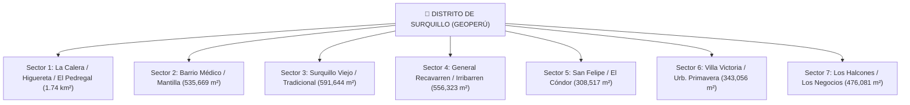

# 📋 Documentación del Proyecto: Mapa Sectorizado de Surquillo

## Sistema de Clasificación Territorial — v3.1 (GeoPerú + Grabador de Rutas por Sector)

---

## 1. Descripción General

Este proyecto implementa la **interfaz web interactiva oficial dividida en 7 SECTORES** del distrito de **Surquillo, Lima, Perú**, basada en las coordenadas oficiales exportadas de **GeoPerú (gob.pe)**.

Incluye el módulo **Grabador de Rutas por Sector**, que permite registrar un itinerario de direcciones dentro del distrito, visualizarlas trazadas en el mapa con marcadores numerados y generar un reporte organizado y agrupado por cada sector territorial.

---

## 2. Mapa de los 7 Sectores

---

## 3. Grabador de Rutas por Sector (Novedad v3.1)

### Características principales:
- 🔴 **Grabación en Vivo:** Haz clic en `▶️ Iniciar Ruta` y busca direcciones o presiona cualquier punto en el mapa.
- 🛡️ **Filtro Distrital Obligatorio:** Solo se pueden agregar paradas que pertenezcan a los sectores de Surquillo. Si se busca una dirección fuera de Surquillo, la app lo detecta con Ray-Casting y emite una alerta.
- 🗺️ **Visualización en Mapa:** Cada parada muestra un marcador circular numerado (`#1`, `#2`, `#3`...) con el color distintivo de su sector y una línea punteada conectando la ruta.
- 📋 **Organización por Sectores:** Al pulsar `⏹️ Finalizar Ruta` o `Ver Resumen`, la aplicación genera un desglose agrupando las direcciones según el sector al que corresponden.
- 💾 **Exportación:**
  - **Copiar Reporte:** Copia al portapapeles un informe formateado listo para compartir por WhatsApp o documentos.
  - **Descargar CSV:** Descarga un archivo de hoja de cálculo con el orden, dirección, sector y coordenadas.
- 🔄 **Persistencia:** La ruta activa se guarda automáticamente en el navegador (`localStorage`).

---

## 4. Detalle de los 7 Sectores y sus Delimitaciones GeoPerú

| Sector | Nombre | Área (m²) | Color | Hitos y Zonas Incluidas |
|--------|--------|-----------|-------|-------------------------|
| **1** | La Calera / Higuereta / El Pedregal | 1,740,000 m² | 🔵 Azul (`#3B82F6`) | Urb. La Calera de la Merced, Trabajadores Telefónicos, Aurora Este II, Doña Tomasita, Jorge Chávez, Los Sauces, Urb. Los Jardines de Higuereta, Aprovissp, El Pedregal, CAPEBCO |
| **2** | Barrio Médico / Mantilla | 535,669 m² | 🟡 Ámbar (`#F59E0B`) | Urb. Barrio Médico, Barrio Obrero, Av. Sergio Bernales, Calle Juan José Calle, San Fernando |
| **3** | Surquillo Viejo / Tradicional | 591,644 m² | 🔴 Rojo (`#EF4444`) | Surquillo Viejo Tradicional, Mercado Central, Jirón Dante, Calle San Agustín, Calle Gonzaga Prada, Calle San Diego |
| **4** | General Recavarren / Irribarren | 556,323 m² | 🟢 Esmeralda (`#10B981`) | General I. Recavarren, Jirón Salaverry, Jirón Manuel Irribarren, Jirón Domingo Elías, Calle José Manuel Iturregui |
| **5** | San Felipe / El Cóndor | 308,517 m² | 🟣 Púrpura (`#8B5CF6`) | Luis Rebaza Córdova, El Cóndor, Av. San Felipe, Calle San Lorenzo |
| **6** | Villa Victoria / Urb. Primavera | 343,056 m² | 💗 Rosa (`#EC4899`) | Villa Victoria, La Merced, Urb. Primavera de Monterrico, El Aeropuerto, Santo Tomás |
| **7** | Los Halcones / Los Negocios | 476,081 m² | 🩵 Cian (`#06B6D4`) | Vict. de Emp. de Min. Viv., Calle Las Águilas, Calle Los Halcones, Calle Los Negocios |

---

## 5. Archivos del Proyecto

| Archivo | Función |
|---------|---------|
| [`index.html`](file:///c:/Users/User/Desktop/proyecto%20maps/index.html) | Estructura web con buscador, grabador de rutas y modal de resumen |
| [`styles.css`](file:///c:/Users/User/Desktop/proyecto%20maps/styles.css) | Estilos con glassmorphism, badges de sector, marcadores numerados y responsive |
| [`app.js`](file:///c:/Users/User/Desktop/proyecto%20maps/app.js) | Lógica de clasificación GeoPerú, grabador de rutas, modal y exportación |
| [`dibujo_geoperu_7 rutas.geojson`](file:///c:/Users/User/Desktop/proyecto%20maps/dibujo_geoperu_7%20rutas.geojson) | Archivo GeoJSON fuente exportado directamente de GeoPerú |
| [`README.md`](file:///c:/Users/User/Desktop/proyecto%20maps/README.md) | Documentación técnica oficial v3.1 |

---

*Documentación v3.1 — Clasificación territorial GeoPerú + Grabador de Rutas por Sector.*
